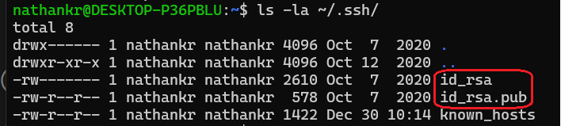
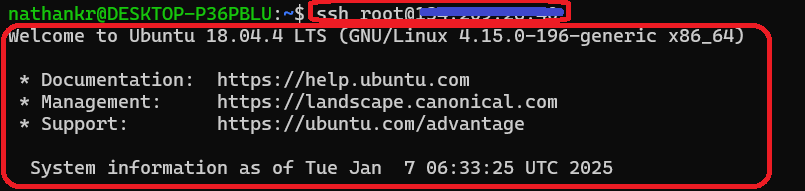
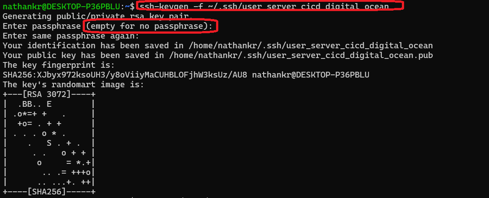
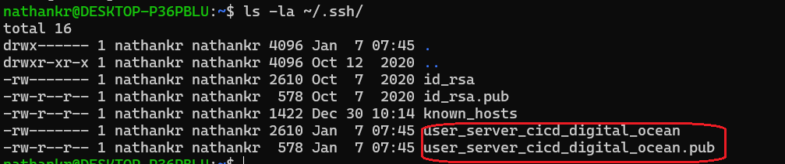
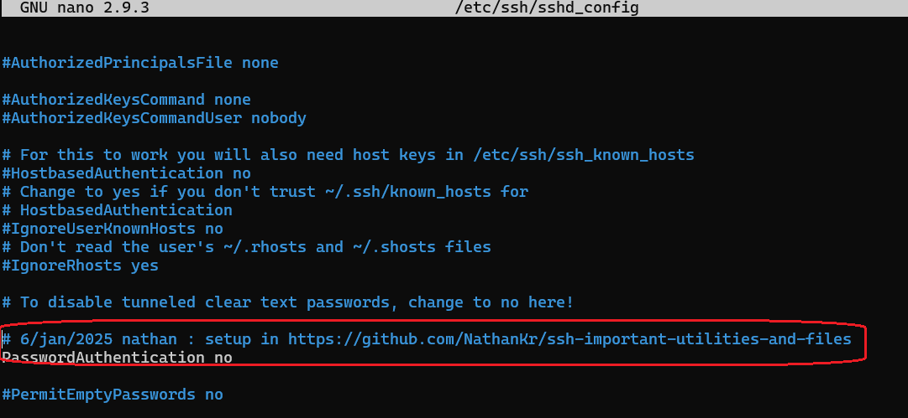
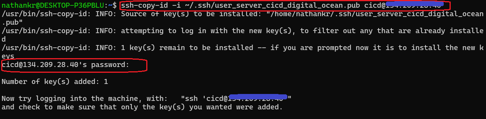
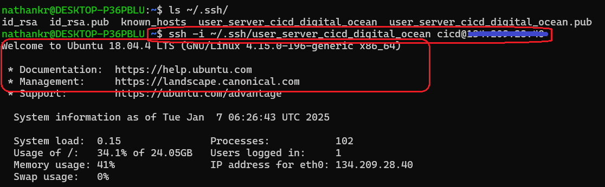

<h1>Project name</h1>
SSH public key authentication

<h2>Project Description</h2>
This repository explains how to authenticate to a VPS using public/private keys via SSH.


<h2>Motivations</h2>
You have a server and you want to work on it secuerly

<h3>Why SSH</h3>
SSH allows the information between the client and server to be encrypted (reference [1]).

<h3>Why Private/Public Key Authentication</h3>

More secure than user\password authentication

<h2>Setup</h2>
<ul> 
<li><strong>Client machine operating system:</strong> Linux or WSL if you use Windows 10</li> 
<li><strong>Server machine operating system:</strong> Linux</li> 
<li><strong>You:</strong> Basic knowledge of Linux</li> </ul>


<h2>How to Authenticate a VPS User Using SSH and Default Public/Private Keys</h2>

<h3>Step 1 : Allow Public Key Autentication via the Server File /etc/ssh/sshd_config</h3>

```bash
nano /etc/ssh/sshd_config
PubkeyAuthentication yes 
```

Invoke the following command after you save the file :

```bash
systemctl restart sshd
```


<h3>Step 2 : Create Local Public/Private Key Files Using ssh-keygen</h3>

Invoke the following command:

```bash
ssh-keygen
```

This will create two files under your client machine <code>~/.ssh</code>: 
<ul> 
<li>Public key file - <code>id_rsa.pub</code></li> 
<li>Private key file - <code>id_rsa</code>
</li> 
</ul>

<h3>Step 3: Copy the Public Key to the Server Using <code>ssh-copy-id</code></h3>

Invoke the following command :

```bash
ssh-copy-id username@hostname
```

The public key is copied to the server file <code>/home/username/.ssh/authorized_keys</code>.

<h3>Step 4: Login to the Server Using the Command <code>ssh</code></h3>

Invoke the following command

```bash
ssh username@hostname
```

<h3>Step 5: Optionally Add More Security via <code>/etc/ssh/sshd_config</code></h3>

Edit the file as follows:

```bash
nano /etc/ssh/sshd_config
PasswordAuthentication no 
PermitRootLogin prohibit-password
```

Invoke the following command after you save the file:

```bash
systemctl restart sshd
```

<h2>Demo</h2> This demo was created using DigitalOcean Droplet and Ubuntu. DigitalOcean Droplet is a VPS.

<h3>Default Public/Private Keys</h3>

Create keys with by invoking the following command

```bash
ssh-keygen 
```

This creates the default key pair files <code>id_rsa</code> and <code>id_rsa.pub</code> as shown in the following image:



Copy the public key to the server using the following command:

```bash
ssh-copy-id 
```

Login using the following command

```bash
ssh username@hostname
```

as shown in the the following image




<h3>Non-Default Public/Private Keys</h3> <p>This use case is relevant if you want to authenticate with more than one server or user.</p>

Create keys as shown in the following image. Notice that specific private key file is used 



The resulting key pair appears in the following image:



<p>Now you need to copy the public key to the server</p> 

you want to use <code>ssh-copy-id</code> and have:

```bash
PasswordAuthentication no
```

as shown in the following image



Then you need to temporarily change it in <code>/etc/ssh/sshd_config</code> to yes, and after saving, invoke the following command:

```bash
systemctl restart sshd
```

Now you can use <code>ssh-copy-id</code>:


```bash
ssh-copy-id -i ~/.ssh/custom_key_name.pub username@your_server_ip
```

as shown in the following image:



Now change back to no:

```bash
PasswordAuthentication no
```

and don't forget to invoke the following command after saving:

```bash
systemctl restart sshd
```

Now login using the specific private key:

```bash
ssh -i path_to_private_key username@your_server_ip
```

as shown in the following image:




<h2>Points of Interest</h2> 
<ul> 
<li>
    <h3>Windows 10 WSL Client</h3>
    </li> 
    <p>I found WSL to be very convenient for using Linux on Windows, so I am using it.</p> 
<li>
<h3>Caveats with 'PasswordAuthentication yes'</h3>
</li> 
<p>If you want to allow a user to authenticate using public key with <code>PasswordAuthentication no</code> and <code>PubkeyAuthentication yes</code>, you will face a catch-22. Only public key authentication is allowed, but the new user does not have a public key on the server. You have two options:</p> 
<ul> 
<li>Add the public key file to the server using another user that already has public/private keys.</li> 
<li>Temporarily set <code>PasswordAuthentication yes</code>, and after <code>ssh-copy-id</code> is finished, revert it back.</li> 
</ul> 
</ul>


<h2>References</h2>
<ul>
    <li><a href='https://www.youtube.com/watch?v=R48-UaZ4q1k'> SSH Essentials in 7.5 minutes </a></li>
</ul>

